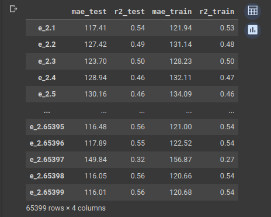

# Inmersion_Datos_Alura

## Índice
* [Introducción](#introducción)
    * [¿De qué trata la base de datos?](#de-qué-trata-la-base-de-datos)
* [Aura 01](#aura-01-tu-primer-colab-con-python-y-pandas)
    * [Desafío 1](#desafío-1)
    * [Desafío 2](#desafío-2)
* [Aula 02](#aula-02-tratamiento-de-datos-y-primeras-gráficas)
    * [Desafío 1](#desafío-1-1)
    * [Desafío 2](#desafío-2-1)
* [Aula 03](#aula-03-profundizando-el-análisis-exploratorio-e-insights)
    * [Desafío 1](#desafío-1-2)
    * [Desafío 2](#desafío-2-2)
* [Aula 04](#aula-04-cruzando-bases-y-machine-learning)
    * [Marco teórico](#marco-teórico)
    * [Desafío 1](#desafío-1-3)
    * [Desafío 2](#desafío-2-3)

## Introducción

La Inmersión en Datos de Alura es un evento que organiza [Alura Latam](https://www.aluracursos.com/) como entrenamiento para Data Science. Durante 4 días se liberarán clases diarias que explicarán de forma intensiva como realizar análisis de datos con Python usando [Pandas](https://pandas.pydata.org/) y otros frameworks, como [Matplotlib](https://matplotlib.org/stable/index.html) y [Seaborn](https://seaborn.pydata.org/), para la visualización. Todo el proceso del la Inmersión se registrará en el archivo [Inmersion_de_datos.ipynb](Inmersion_de_datos.ipynb).

La Inmersión en Datos también consta de varios desafíos diarios para los participantes, y en este README llevaré a cabo la resolución de estos. Cada días se libera un Aura numerada del 1 al 4, y aquí se mostrarán las resoluciones de sendos desafíos. En mi caso, La Inmersión en Datos durará desde el 12 al 14 de septiembre del 2023.

La finalidad del programa es crear un modelo de predicción para determinar el valor de un inmueble usando una gran variedad de parámetros, y apoyándose en la librería de Machine Learning [scikit-learn](https://scikit-learn.org/stable/). Este modelo se desarrollarán en la Aula 04.

### ¿De qué trata la base de datos?

La base de datos está dada por el archivo CSV [inmuebles_bogota.csv](inmuebles_bogota.csv) que resume los inmuebles en venta de la ciudad de Bogotá. El dataframe es el siguiente

```python
import pandas as pd

inmuebles = pd.read_csv('./inmuebles_bogota.csv')
inmuebles.head()
```


Como se puede observar, el dataframe compila varios atributos de los inmuebles en venta, como el tipo, la cantidad de habitaciones, la ubicación, etcétera. Como se puede observar, los datos están en español, lo que podría dar problemas al usar python cuando tengamos que tratar con vocales con acentos y la letra ñ. Por eso es necesario renombrar esas columnas problemáticas.


```python
#Creamos un diccionario con los reemplazos para las columnas a renombrar
columnas = {
    'Baños' : 'Banios',
    'Área' : 'Area'
}
# Renombramos las columnas
inmuebles = inmuebles.rename(columns = columnas)
inmuebles.sample(10)
```


y de esta forma será más sencillo trabajar.

## Aura 01: Tu primer colab con python y pandas
**Desafíos:**
1. Promedio de área de todos los barrios, y realizar un gráfico con el top 10
2. Consultar otros datos estadísticos: conteo, mediana, valores mínimos y máximos.

### Desafío 1

Para este desafío me ayudé del método de pandas [`groupby`](https://pandas.pydata.org/docs/reference/api/pandas.DataFrame.groupby.html), que permite agrupar por un campo los registros de la base de datos; es [muy parecido a la función que se usa en MySQL](https://pandas.pydata.org/docs/getting_started/comparison/comparison_with_sql.html). De esta forma será más sencillo agrupar los diferentes barrios que aparecen en el dataframe, y calcular sendos promedios de la áreas de los inmuebles.

```python
area_estadistica = inmuebles[['Barrio','Area']].groupby('Barrio').describe()
area_estadistica.columns = [dato for _,dato in area_estadistica.columns]

area_estadistica
```


Nótese que también se usó el método [`describe`](https://pandas.pydata.org/docs/reference/api/pandas.core.groupby.DataFrameGroupBy.describe.html#pandas.core.groupby.DataFrameGroupBy.describe) que no solo calcula el promedio (mean), sino también varios parámetros estadísticos que no ayudarán con el siguiente desafío.

Ya teniendo el dataframe `area_estadistica` realizar el gráfico es bastante sencillo. Ya que la cantidad de datos es bastante grande, vamos a graficar solo el Top 10 de Barrios con un promedio de área por inmueble mayor.

```python
area_promedio = area_estadistica['mean'].sort_values(ascending = False)

area_promedio.head(10).plot(kind = 'bar', title = 'Top 10 Promedio de Áreas', ylabel = 'Área (m^2)')
```


#### Análisis

Como podemos observar, la diferencia del top 1 al top 2 es bastante marcada; siendo con Modelia alrededor de $4500 m^2$ y Libertador apenas de alrededor de $800 m^2$. Esto nos lleva a la pregunta, ¿qué clase de inmuebles hay en Modelia para tener tanta extensión? Verifiquemos eso.

```python
inmuebles[inmuebles.Barrio == 'Modelia'].Tipo.value_counts()
```


Podemos observar que en Modelia solo tenemos casas y departamentos en cantidades similares. Promediando esto dimensiones tan grandes, quizás Modelia se trate de una zona residencial con costos de vida bastante altos, aunque también hay que revisar otros parámetros estadísticos, como la desviación estándar, para verificar esa afirmación.
```python
area_estadistica.loc['Modelia']
```


Al parecer los datos están muy dispersos, dada la desviación estándar. El tercer cuartil tiene un valor bastante pequeño, por lo que los datos grandes son bastante escasos. Siendo los datos más grandes tan escasos, se podría de tratar de errores en la captura de datos, o bien, un barrio un tanto diverso.

### Desafío 2

Para este desafío se usará de nuevo el dataframe `area_estadistica` ya que posee los parámetros estadísticos del área que usaremos para este desafió. Hemos renombrado los campos para tener nombres más entendibles para hispanohablantes.

```python
columnas = {
    'count' : 'contador',
    'mean' : 'promedio',
    'std' : 'd_estandar',
    '25%' : 'qt1',
    '50%' : 'mediana',
    '75%' : 'qt3'
}

area_estadistica = area_estadistica.rename(columns = columnas)

area_estadistica
```


Esta tabla renombrada ya se había usado anteriormente.

Ahora vamos a mostrar una serie de gráficas Top 10 para algunos de los parámetros estadísticos.

#### Gráficos

**Desviación estándar**

```python
area_d = area_estadistica['d_estandar'].sort_values(ascending = False)

area_d.head(10).plot(kind = 'bar', title = 'Top 10 desviación estándar del total de áreas', ylabel = 'Área (m^2)')
```


**Contador (Histograma)**

```python
area_contador = area_estadistica['contador'].sort_values(ascending = False)

area_contador.head(10).plot(kind = 'bar', title = 'Top 10 barrios con más inmuebles en venta', ylabel = 'count')
```


**Valor Mínimo**

```python
area_min = area_estadistica['min'].sort_values(ascending = False)

area_min.head(10).plot(kind = 'bar', title = 'Top 10 valores mínimos por barrio', ylabel = 'Área (m^2)')
```


**Valor Máximo**

```python
area_max = area_estadistica['max'].sort_values(ascending = False)

area_max.head(10).plot(kind = 'bar', title = 'Top 10 valores máximos por barrio', ylabel = 'Área (m^2)')
```


**Mediana**

```python
area_mediana = area_estadistica['mediana'].sort_values(ascending = False)

area_mediana.head(10).plot(kind = 'bar', title = 'Top 10 mediana de áreas por barrio', ylabel = 'Área (m^2)')
```


## Aula 02: Tratamiento de Datos y Primeras Gráficas

**Desafíos**
1. Estudiar mejor el histograma de valores, seleccionar 3 tipos de inmuebles (refinar el gráfico).
2. Precio del metro cuadrado por barrio, y encontrar un gráfico adecuado para esta nueva variable.

En el aula 02 se trató la columna Valor del dataframe para obtener los valores numéricos de los inmuebles. El dataframe quedó de la siguiente forma

```python
inmuebles.sample(10)
```


Se agregaron varias columnas, pero lo que nos interesa ahora es la columna 'Precio_Millon' para resolver los desafíos. Este número es el valor, en millones de pesos colombianos (COP) de cada inmueble.

### Desafío 1

El histograma de valores es el siguiente:

```python
import matplotlib.pyplot as plt
import seaborn as sns

plt.figure(figsize = (10,6))

grafica = sns.histplot(data = inmuebles, x = 'Precio_Millon', kde = True, hue = 'Tipo')
grafica.set_title('Distribución de Valores en los inmuebles en Bogotá')

plt.xlim((50,1000))
plt.savefig('./img/valor_unmueble.png', format = 'png')
plt.show()
```


Vamos a elegir el top 3 de tipos de inmuebles que más se repiten.

```python
inmuebles.Tipo.value_counts()
```


Por lo visto, el top 3 de tipos de inmuebles son Apartamento, Casa y Oficina/Consultorio. Vamos a limitar el histograma anterior a estos tres tipos. Creamos una lista que usaremos para el filtro.

```python
tipo_sel = ['Apartamento', 'Casa', 'Oficina/Consultorio']
```
Luego, creamos el gráfico, modificando algunos detalles visuales para darle una mejor presentación.

```python
plt.figure(figsize = (12,8)) # Creamos lienzo y ajustamos tamaño
sns.set_theme(font_scale = 1.5) # Ajustamos el tamaño de la fuente

grafica = sns.histplot(data = inmuebles_simpl, x = 'Precio_Millon',
                       kde = True,
                       hue = 'Tipo',
                       palette = 'dark',  # Cambiamos colores
                       multiple="stack"   # Evitamos que las barras sean transparentes
                       )

grafica.set_title('Distribución de precios en los inmuebles en Bogotá')
grafica.set_xlabel('Precio (Millones COP)')
grafica.set_ylabel('Frecuencia')

plt.xlim((50,2000))
plt.savefig('./img/valor_inmueble_top3.png', format = 'png')
plt.show()
```


Lo que tenemos en el gráfico es la distribución de los valores de los tres tipos de inmueble entre 50 7 2000 millones COP. Como se puede observar, la cantidad de Apartamentos en oferta domina en general a los otros dos tipos, tanto que es difícil observarlos. Hagamos un par de zoom in para apreciarlos de mejor manera.

```python
plt.figure(figsize = (12,8))
sns.set_theme(font_scale = 1.5)

grafica = sns.histplot(data = inmuebles_simpl, x = 'Precio_Millon', kde = True, hue = 'Tipo', palette = 'dark',  multiple="stack")
grafica.set_title('Distribución de precios en los inmuebles en Bogotá')
grafica.set_xlabel('Precio (Millones COP)')
grafica.set_ylabel('Frecuencia')

plt.xlim((50,2000))
plt.ylim((0,110))
plt.savefig('./img/valor_inmueble_top3_zoomin_1.png', format = 'png')
plt.show()
```


```python
plt.figure(figsize = (12,8))
sns.set_theme(font_scale = 1.5)

grafica = sns.histplot(data = inmuebles_simpl, x = 'Precio_Millon', kde = True, hue = 'Tipo', palette = 'dark',  multiple="stack")
grafica.set_title('Distribución de precios en los inmuebles en Bogotá')
grafica.set_xlabel('Precio (Millones COP)')
grafica.set_ylabel('Frecuencia')

plt.xlim((50,2000))
plt.ylim((0,7))
plt.savefig('./img/valor_inmueble_top3_zoomin_2.png', format = 'png')
plt.show()
```


#### Análisis

De estos gráficos se pueden llegar a una serie de conclusiones:
1. La oferta de departamentos de bajo costo es bastante alta. Quizás haya habido algún proyecto inmobiliario destinado a las viviendas multi-familiares.
2. La oferta tanto de departamentos como de casas tiene un comportamiento bastante suave entre 50 y 1000 millones COP, después de eso hay "baches" en algunos precios. Esto podría se indicativo de la capacidad económica de los habitantes de Bogotá.
3. Las Oficinas y consultorios, aunque son el top 3, la diferencia es bastante marcada con el top 2. La grafica no es en absoluto suave, y no presenta un comportamiento predecible. Tiene sentido, ya que es un mercado muy de nicho.

### Desafío 2

Vamos a crear una nueva columna, donde guardaremos el costo por $m^2$ que se está cobrando por cada vivienda. La formula es sencilla
$$costo\ por\ m^2 = \frac{costo\ total\ del\ inmueble}{Área}$$
Por lo que, en código queda de la siguiente forma
```python
inmuebles['Precio_por_m2'] = inmuebles.Precio_Millon / inmuebles.Area

inmuebles.sample(10)
```


Donde la nueva columna `Precio_por_1m2` nos dice el costo en millones de COP por cada $m^2$.

#### Gráfica

Para la gráfica opté por usar `barplot` para graficar los promedios del valor por $m^2$ de cada barrio. Comenzamos obteniendo los promedios,

```python
datos_est = inmuebles.groupby(by = 'Barrio').describe()

top_promedio_porM2 = datos_est.Precio_por_m2[['mean', 'std']].sort_values(by = 'mean', ascending=False).head(10)
top_promedio_porM2 = top_promedio_porM2.reset_index()
top_promedio_porM2
```


además también se obtiene la desviación estándar, con la finalidad de generar **barras de error**.

Creamos la gráfica:
```python
# Reiniciamos settings
sns.set_theme()
plt.figure(figsize = (10,8))

sns.barplot(data = top_promedio_porM2, y = 'mean', x = 'Barrio')

#Obtenemos la desviación estandar
sigma = top_promedio_porM2['std']

x = top_promedio_porM2['Barrio']
y = top_promedio_porM2['mean']

# Graficamos las barras de error
plt.errorbar(x = x, y = y, yerr=(sigma, sigma), fmt='none', color='k', capsize=5)

plt.title('Top 10 Promedio del costo por m2 por barrio')
plt.xlabel('Barrio')
plt.ylabel('Promedio (millones COP)')

# Rotamos las etiquetas de x para que los nombres no se solapen
plt.xticks(rotation = 80)

plt.savefig('./img/top10_primedio_costo_m2.png', format = 'png')
plt.show()
```


La altura de las barras llega al promedio de los datos, y las barras de error, que se extienden una desviación por arriba y por abajo, muestras la variación que tienen los datos alrededor del promedio.

#### Análisis

Como podemos observar, el top 10 de precio por $m^2$ difiere mucho del top 10 de costos total de inmueble. En este caso el barrio El Virrey se lleva el top 1, además que los demás no se desvían demasiado. La desviación estándar también es bastante aceptable, siendo menor a 3 para todos los casos, lo que no dice que los precios son bastante consistentes en cada barrio.

Es bastante notorio el caso de La Merced, que ocupa el top 3, donde también tiene la desviación estándar menor. Esto indica que los costos por $m^2$ en ese barrio son bastante estables.

## Aula 03: Profundizando el análisis exploratorio e insights
**Desafíos**

1. Dar un vistazo a la base de datos del DANE, entender estas variables, conceptualmente para entender mejor el contexto de esta base.
2. Organizar tu notebook para tu proyecto quede mejor presentado

### Desafío 1

En esta ocasión los desafíos son más teóricos que las clases pasadas, por lo tanto el código que se puede escribir será mínimo. Por lo tanto, a modo de solución, escribiré en esta sección un resumen de la investigación de los archivos CSV que usaremos en la siguiente clase.

Los datos del DANE se obtuvieron de su [página web](https://microdatos.dane.gov.co/index.php/catalog/743), y los archivos CSV descargados el 13 de septiembre del 2023 se encuentran en el directorio [datos_varios_colombia/](datos_varios_colombia/). La investigación de estos archivos se realiza con la [documentación](datos_varios_colombia/ddi-documentation-spanish-743.pdf) que dispone también el DANE.

#### Identificación (Capítulo A)

Esta archivo se guardó en la variable `datos_raw` durante la clase, para después hacer un filtro que permitiera quedarnos solo con los datos de Bogotá —municipio con indicador 11001. Esta archivo **contiene datos de identificación de la vivienda**, como Departamento, municipio, clase, etcétera; en total posee 11 columnas.

Las columnas, y su abreviatura usada en el archivo, se resume en la siguiente tabla


En la columna **NOMBRE** se muestra el nombre que tendrá la columna o campo en el archivo, en **ETIQUETA** la descripción y formato en el que se mostrará la información, y en **PREGUNTA** la pregunta que se realizó al encuestado.

Esta tabla es la básica al tratar con un modelo predictivo, ya que nos brinda información de la zona y el tipo del inmueble al que se refiere, lo que es crucial a la hora de asignar un valor a la propiedad.

#### Datos de la vivienda y su entorno (Capítulo B)

En este caso, se creó un dataframe con este archivo llamado `datos_b` durante la clase. Esta contiene **los datos propios de la vivienda, así como de su entorno**. Por ejemplo, las vías de acceso, iluminación, condiciones estructurales, posibles problemas ambientales, etcétera. Este archivo posee 63 campos.

La explicación del los datos se expone en el siguiente fragmento


Los campos constan del **DIRECTORIO** así como de varios más cuyo nombre clave comienza con **NVCBP** y el factor de expansión (**FEX_X**). Las columnas NVCBP constan de la información dada por los encuestados sobre el estado de su viviendo y su entorno, como se muestra en la tabla. Los datos de estos campos son numéricos discretos, comenzando desde 1, enumerando dos o varias respuestas posibles a las preguntas.

Un posible abordaje de los datos mostrados en este dataset sería generalizar los datos a zonas más amplias como las UPZ o las localidades, haciendo uso del archivo anterior, y dar con un estado general de las viviendas en vecindades.

#### Condiciones habitacionales del hogar (Capítulo C)

Este archivo se guardó en la variable `datos_c`. Posee información del **estado administrativo de la vivienda**. Por ejemplo, si es propia o arrendada, los gastos por habitar la vivienda, la financiación de los hogares para comprar la vivienda, la calidad de los espacios, etcétera. Este archivo consta de 142 columnas.


En este caso, la tabla consta de datos de identificación, y los resultados de la encuentras con campos que comienzan con **NHCCP**. Estos datos son numéricos, contando con datos discretos con un conjunto de respuestas disponibles, así como con continuos para respuestas más específicas que involucren cantidades.

En este dataframe se podría obtener información sobre el costo de vida que la vivienda exige para su mantenimiento, lo que influye en su costo de venta.

#### Composición del hogar y demografía (Capítulo E)

Guardado en la variable `datos_e`, este dataset habla de la **composición del hogar y la demografía**. Datos como el tamaño, distribución y dinámica demográfica de la población, sus características demográficas, integrantes del hogar y el núcleo familiar, etcétera. Este archivo consta con 68 campos.


Además de los datos de identificación, tenemos también los datos que se obtienen de la encuesta, en este caso comenzando por **NPCEP**, así como un par de datos que se salen de este patrón como **ORDEN** y **SEXO** del encuestado. Por lo demás, el formato sigue siendo dado por datos numéricos discretos y continuos, para respuestas definidas o específicas, respectivamente.

Los datos contenidos en este archivo poseen datos referentes más a los residentes del hogar, lejos de la vivienda. Quizás sean útiles para entender la dinámica de los posibles vecinos al adquirir un hogar, lo que impacta al mercado inmobiliario de una forma u otra.


#### Educación (Capítulo H)

Se guarda en la variable llamada `datos_h`. Como su nombre lo indica **recopila datos educativos de la población**, desde los 5 años en adelante. Parámetros como el analfabetismo, niveles educativos y años de estudio, así como las razones del ausentismo escolar y los datos de transporte y económicos relacionados con la asistencia a los centros de estudio. Este archivo consta de 136 campos.


Los tipos de campos no difieren mucho de los archivos anteriores. Se cuenta con los campos de identificación, así como los resultados de la encuesta, esta vez identificada con el prefijo **NPCHP** con datos numéricos discretos para un número fijo de respuestas posibles, y datos numéricos continuos para respuestas que requieran cantidades específicas.

No es extraño que el ambiente escolar sea un tema importante al adquirir una vivienda, especialmente a hogares que cuentan con menores de edad. La accesibilidad a los centro educativos, así como la calidad de estos influyen en los costos de los inmuebles, ya sean residenciales o los locales para negocios que dependan de la actividad educativa, como la venta de útiles escolares.


#### Fuerza de trabajo (Capítulo K)

Guardado en la variable `datos_k`, esta contiene **los datos laborales y de actividad económica de la población**. Recopila datos como el origen de los ingresos de las personas dentro del hogar, ya sean adquiridos mediante el mercado laboral o de otras fuentes, así los datos de desempleo. Este archivo cuenta con 170 campos.


En este caso los campos que contienen las respuestas de la encuesta comienzan con **NPCKP**, y siguen siendo datos numéricos discretos o continuos, así como los campos de identificación.

La información de la fuerza de trabajo es importante, ya que la accesibilidad a los centros de trabajo influye a aquellas personas que deseen adquirir una vivienda, así como a empresas que deseen contratar a empleados que vivan cerca de las instalaciones.

#### Percepción sobre las condiciones de vida y el desempeño institucional (Capítulo L)

Este dataset se guarda en la variable `datos_l`, y guarda datos sobre la **percepción de la población sobre la calidad de vida en los alrededores de su vivienda**. Datos sobre las victimas de actividades delictivas, así como la calidad de las instalaciones urbanas y grupos vulnerables, entre otras cosas, se recopilan en este archivo. Contiene 179 campos.


En este caso, los campos que contienen los resultados de la encuesta se identifican porque comienzan con **NHCLP**, y constan de datos numéricos discretos y continuos, aunque en su gran mayoría sean discretos con posibles respuestas definidas.

No cabe duda que el nivel de criminalidad impacta la calidad de vida de las personas en una zona, y la calidad de vida es fundamental cuando hogares o empresas buscan asentarse en un lugar. Por ende, el mercado inmobiliario se verá afectado.

#### Conclusiones de la actividad

Estos archivos son los seleccionados por los instructores de la **Inmersión en Datos de Alura**, que serán útiles en la actividad de la Aula 04 en la que se creará un modelo predictivo para el valor de las propiedades.

No me cabe duda que se realizó un buen trabajo en esta selección, ya que las condiciones del barrio, de la vivienda, el nivel educativo de la zona, las oportunidades de empleo y la percepción de la criminalidad, entre otras, son variables muy importantes para valuar un inmueble de manera más precisa.

Debe haber un equilibrio entre el atractivo de la vivienda, teniendo en cuenta el entorno y los servicios estatales ofrecidos, y el impacto económico de esta. Por ejemplo, si el barrio no es muy atractivo, el precio podría ser suficientemente bajo para compensarlo y cerrar la compra.

### Desafío 2

A lo largo de los días anteriores, me he esforzado para mantener organizado mi [notebook](Inmersion_de_datos.ipynb) dividiendo en secciones y subsecciones para encontrar de forma más rápida y cómoda los detalles que se requieran repasar. Además, he puesto bloques de texto explicando lo que se está realizando en ese momento.

El contenido de las cuatro aulas está contenida dentro del mismo notebook, y divididas por secciones. Dentro de cada sección se abren subsecciones cuando se introduce un nuevo concepto, se realiza un análisis específico, se crean gráficos y se definen los desafíos.

Elegí esta organización para aprovechar las importaciones y las variables que se han hecho en aulas anteriores. Sin embargo, esto también significa sacrificar la eficiencia de los códigos. Después de alrededor de 382 bloques de código, se dejan variables que ya no se usan y ocupan espacio en la memoria virtual.

Por eso, para este desafío voy a agregar una subsección al final de cada sección donde se eliminarán variables que ya no se usarán en el futuro. Para lograr esto usaré la función `dir()` de Python sin argumentos, que devuelve una lista que contiene los nombres de las variables dentro de scope global.

```python
dir()
```


De esta forma podré localizar de forma más rápida aquellas variables que no usaré después, y borrarlas usando `del`.

## Aula 04: Cruzando bases y Machine Learning

**Desafíos**

1. Probar con otros modelos de ML;
2. Trabajar más con los datos y crear nuevas variables;
3. Probar predicciones para casos reales;
4. Crear un proyecto con los resultados de la inmersión y publicarlo en las redes sociales mostrando el trabajo realizado. Recuerda etiquetar a @aluralatam y utilizar los hashtags #InmersionDatos e #InmersionDatosAluraLatam.

### Marco teórico

La teoría detrás del Machine Learning es muy extensa. Es tal que un estudio completo de los modelos de *Deep Learning* nos llevaría varios párrafos y muchas matemáticas para entenderlos en su totalidad. Sin embargo, no es necesario al usar el módulo [scikit-learn](https://scikit-learn.org/stable/), que hace todo el trabajo tedioso por nosotros.

No obstante, para poder analizar y comprender los resultados que obtenemos para el modelaje, si requerimos uno qué otro conocimiento. Por lo pronto, comencemos con algunas definiciones que usaremos en los desafíos.

Primero vamos a definir una función para facilitar el uso de la librería sklearn

```python
from sklearn.linear_model import LinearRegression
from sklearn.metrics import mean_absolute_error, r2_score
from sklearn.model_selection import train_test_split

def modelar(p_entrenamiento, target_entrenamiento, tamano_test = 0.25, semilla = 99, imprimir_mensaje = True):
  X = datos_ml[p_entrenamiento]
  y = datos_ml[target_entrenamiento]

  # Split
  X_train, X_test, y_train, y_test = train_test_split(X, y, test_size = tamano_test, random_state = semilla)

  # Modelo
  modelo_1 = LinearRegression()
  modelo_1.fit(X_train, y_train)

  # Predicción
  y_predict_test = modelo_1.predict(X_test)

  y_predict_train = modelo_1.predict(X_train)

  # Validación
  mae_test = mean_absolute_error(y_test, y_predict_test)
  r2_test = r2_score(y_test, y_predict_test)

  mae_train = mean_absolute_error(y_train, y_predict_train)
  r2_train = r2_score(y_train, y_predict_train)

  if imprimir_mensaje:
    print('Validación con los datos de testeo')
    print(f'\tEl error absoluto medio fue de {mae_test}')
    print(f'\tEl Coeficiente de determinación (R^2) fue de {r2_test}')
    print('Validación con los datos de entrenamiento')
    print(f'\tEl error absoluto medio fue de {mae_train}')
    print(f'\tEl Coeficiente de determinación (R^2) fue de {r2_train}')

  salida = {'modelo' : modelo_1,
            'mae_test' : mae_test,
            'r2_test' : r2_test,
            'mae_train' : mae_train,
            'r2_train' : r2_train}

  return salida
```

La función `modelar` tiene como parámetros lo siguiente
* `p_entrenamiento` : El conjunto de campos/parámetros que se usarán para el entrenamiento y
* `target_entrenamiento` : El campo objetivo de entrenamiento,

este último campo será el objetivo que se desea predecir. Además también se definen un par de parámetros con valores predeterminados, `tamano_test` y `semilla`, para modificar, si es necesario, el tamaño de la muestra para el test, o el SEED. Además, un parámetro `imprimir_mensaje` para poder modificar si queremos salida en pantalla o no.

La salida de la función será un diccionario que contendrá el modelo y las mediciones de validación.

El modelo que se usará, por el momento, es [`LinearRegression`](https://scikit-learn.org/stable/modules/generated/sklearn.linear_model.LinearRegression.html), que se encuentra en el sub-módulo `linear_model` de `sklearn`; este modelo se sustituirá más adelante para cumplir con el primer desafío. Además, se usará como auxiliar la función `train_test_split` del sub-módulo `model_selection` para obtener la muestra para la validación.

Por otra parte, para realizar la validación, nos respaldaremos con las funciones `mean_absolute_error` y `r2_score`, del sub-módulo `metrics`, también de `sklearn`. Estas funciones calculan el *Error absoluto medio* y el *Coeficiente de determinación*, que son medidas estadísticas. Pero, ¿qué significan estas medias exactamente? Las vamos a definir.

#### Error absoluto medio
Fuente: [Wikipedia](https://en.wikipedia.org/wiki/Mean_absolute_error)

El **Error absoluto medio**, o $MAE$ por sus siglas en inglés, es una medida estadística del error entre dos pares de observaciones del mismo fenómeno. Es decir, sin comparamos los conjuntos $X$ y $Y$, que podrían ser datos de predicciones y datos de observación, por decir un ejemplo, el MAE se calcula como

$$MAE = \frac{1}{n}\sum_{i = 1}^{n} |x_i - y_i| = \frac{1}{n}\sum_{i = 1}^{n} |e_i|, $$

con $n$ el número de los datos y $e_i = x_i - y_i$ es el error absoluto del par de datos $i$-ésimos de los conjuntos. Se podría decir que el $MAE$ es el *promedio de los errores absolutos*, donde las $x$ son los valores de predicción y las $y$ los valores reales.

#### Coeficiente de determinación

Fuentes: [Wikipeda](https://en.wikipedia.org/wiki/Coefficient_of_determination) y [documentación de `r2_score`](https://scikit-learn.org/stable/modules/generated/sklearn.metrics.r2_score.html#sklearn.metrics.r2_score)

El Coeficiente de determinación, denotado como $R^2$, es una medida estadística que determina la calidad del modelo estadístico para replicar los resultados, es decir, la predicción. $R^2$ puede tomar valores entre 0 y 1, donde 0 indica una *predicción imperfecta*, y 1 una *predicción perfecta*.

El cálculo de $R^2$ no es trivial, por lo que se omitirá.

#### ¿Qué se hizo en clase?

El Aula 04 fue la más pesada de la Inmersión en Datos. No suelo dar muchos detalles en este README de lo que se hizo en clase, pero dada las circunstancias, les daré un breve resumen:

1. Los instructores, después de estudiar los datos del DANE vistos en el aula anterior, seleccionaron algunos parámetros o campos y guardaron el *dataframe* en el archivo [datos_dane.csv](datos_varios_colombia/datos_dane.csv) y se guardó en la variable `datos_ml`.

    El *dataframe* consta de 9857 registros con 55 campos.

2. Renombraron los campos por nombres más descriptivos:

    ```python
    dic_dane = {
        'NVCBP4':'CONJUNTO_CERRADO',
        'NVCBP14A':'FABRICAS_CERCA', 'NVCBP14D':'TERMINALES_BUS', 'NVCBP14E':'BARES_DISCO',
        'NVCBP14G':'OSCURO_PELIGROSO', 'NVCBP15A':'RUIDO', 'NVCBP15C':'INSEGURIDAD',
        'NVCBP15F':'BASURA_INADECUADA', 'NVCBP15G':'INVASION','NVCBP16A3':'MOV_ADULTOS_MAYORES',
        'NVCBP16A4':'MOV_NINOS_BEBES',
        'NPCKP17':'OCUPACION','NPCKP18':'CONTRATO','NPCKP23':'SALARIO_MES',
        'NPCKP44A':'DONDE_TRABAJA', 'NPCKPN62A':'DECLARACION_RENTA',
        'NPCKPN62B':'VALOR_DECLARACION', 'NPCKP64A':'PERDIDA_TRABAJO_C19',
        'NPCKP64E':'PERDIDA_INGRESOS_C19',
        'NHCCP3':'TIENE_ESCRITURA', 'NHCCP6':'ANO_COMPRA', 'NHCCP7':'VALOR_COMPRA', 'NHCCP8_1':'HIPOTECA_CRED_BANCO',
        'NHCCP8_2':'OTRO_CRED_BANCO', 'NHCCP8_3':'CRED_FNA', 'NHCCP8_6':'PRESTAMOS_AMIGOS',
        'NHCCP8_7':'CESANTIAS', 'NHCCP8_8':'AHORROS', 'NHCCP8_9':'SUBSIDIOS',
        'NHCCP9':'CUANTO_PAGARIA_MENSUAL', 'NHCCP11':'PLANES_ADQUIRIR_VIVIENDA',
        'NHCCP11A':'MOTIVO_COMPRA', 'NHCCP12':'RAZON_NO_ADQ_VIV', 'NHCCP41':'TIENE_CARRO','NHCCP41A':'CUANTOS_CARROS',
        'NHCCP47A':'TIENE_PERROS', 'NHCCP47B':'TIENE_GATOS', 'NHCLP2A':'VICTIMA_ATRACO', 'NHCLP2B':'VICTIMA_HOMICIDIO',
        'NHCLP2C':'VICTIMA_PERSECUSION',
        'NHCLP2E':'VICTIMA_ACOSO', 'NHCLP4':'COMO_VIVE_ECON', 'NHCLP5':'COMO_NIVEL_VIDA',
        'NHCLP8AB':'REACCION_OPORTUNA_POLICIA', 'NHCLP8AE':'COMO_TRANSPORTE_URBANO', 'NHCLP10':'SON_INGRESOS_SUFICIENTES',
        'NHCLP11':'SE_CONSIDERA_POBRE', 'NHCLP29_1A':'MED_C19_TRABAJO',
        'NHCLP29_1C':'MED_C19_CAMBIO_VIVIENDA', 'NHCLP29_1E':'MED_C19_ENDEUDAMIENTO',
        'NHCLP29_1F':'MED_C19_VENTA_BIENES','NPCHP4':'NIVEL_EDUCATIVO'
        }

    datos_dane = datos_dane.rename(columns = dic_dane)
    datos_dane.columns
    ```

3. Remplazaron los nombres descriptivos de las UPZ por su código numérico asignado por el gobierno Colombiano. Usaron el archivo [cod_upz.csv](datos_varios_colombia/cod_upz.csv) que posee las correspondencias.

4. Fueron quitaron los *outliers* hasta llegar a que `Precio_Millon` fuera mayor a 1200 millones de COP o menor a 60 millones, hasta llegar
    ```python
    datos_ml = datos_ml.query('Precio_Millon <= 1200 & Precio_Millon >= 60')
    ```

5. Crearon un mapa de calor para mirar las correlaciones, para después realizar varios experimentos con varios modelos variando los parámetros de entrenamiento cada vez.

### Desafío 2

La resolución de los desafíos 1, 2 y 3 no las realizaré en ese orden. Lo primero que realizaré serán pruebas para determinar la calidad de la predicción usando diversos parámetros, diferentes a los que usaron los instructores, para `LinearRegression`, para luego probar con otros modelos de `sklearn`. Por ende por eso comenzaremos por el desafío 2.

Miremos el mapa de calor de `datos_ml` para elegir los parámetros que usaré para mis modelos,

```python
plt.figure(figsize=(18, 8))

heatmap = sns.heatmap(datos_ml.corr(), vmin=-1, vmax=1, annot=True, cmap='BrBG')
heatmap.set_title('Correlación de las variables', fontdict={'fontsize':18}, pad=16)

```


Lo que me interesa ver en este mapa de calor, es la columna correspondiente a `Precio_Millon` y su correlación con los demás parámetros. Es bastante notorio que el parámetro con el que no guarda mucha correlación es con 'Area'.

#### Primer experimento

Para este primer experimento usaré casi todos los parámetros que aparecen en el mapa de calor. Excluiré 'Area', por su baja correlación, y a `Precio_por_m`, ya que es el promedio que se descartó anteriormente,

```python
parametros = ['Habitaciones', 'Banios', 'Valor_m2_barrio', 'CONJUNTO_CERRADO',
              'INSEGURIDAD', 'TERMINALES_BUS', 'BARES_DISCO', 'RUIDO',
              'OSCURO_PELIGROSO', 'SALARIO_MES', 'TIENE_ESCRITURA', 'PERDIDA_TRABAJO_C19',
              'PERDIDA_INGRESOS_C19', 'PLANES_ADQUIRIR_VIVIENDA', 'COD_UPZ_GRUPO', 'SALARIO_ANUAL_MI']

```

Ahora vamos a crear el modelo usando la función creada anteriormente

```python
experimento_1 = modelar(parametros, 'Precio_Millon')

```


Un resultado ligeramente mejor que el obtenido por los instructores en clase. ¿Podrá mejorar?

#### Segundo experimento

Para este experimento vamos a arriesgarnos. Crearé una serie de modelos y las compararé entre sí para seleccionar un pequeño grupo de los mejores. ¿Qué conjuntos de parámetros usaré para esta prueba? Usaremos todas las combinaciones que se puedan forma de mi lista `parametros`.

Usaremos para ello el concepto de *Conjunto Potencia* (Power Set en inglés); para revisar la definición revisa el articulo de Wikipedia [aquí](https://en.wikipedia.org/wiki/Power_set). Veamos el código para crear un conjunto potencia desde otro conjunto

```python
from itertools import chain, combinations
def conjunto_potencia(lista):
    salida = chain.from_iterable(combinations(lista, r) for r in range(len(lista)+1))
    return salida

```
Con `conjunto_potencia` se creará un conjunto de conjuntos con todas las combinaciones posibles, tanto en tamaño como diferentes combinaciones de parámetros. Y, para nuestro caso, son muchas combinaciones

```python
len(list(conjunto_potencia(parametros)))

out: 65536
```
Pero no vamos a crear 65536 modelos, sino que de ahí vamos a eliminar aquellos conjuntos con menos de 3 parámetros; quedan, entonces, 65399 modelos.

La siguiente función realizará todas las pruebas:

```python
def pruebas(imprimir_salto = 100):
  n = 1 #Indica el numero de experimento

  experimento_2i = dict()
  mensaje = 'e_2.'
  para_dataframe = dict()

  print(f'Realizando {len(list(conjunto_potencia(parametros)))} experimentos:')

  for p in conjunto_potencia(parametros):

    if len(p) < 3: # Quitamos los conjuntos que tengan menos de 3 elementos
      continue

    experimento_2i[mensaje + str(n)] = modelar(list(p), 'Precio_Millon', imprimir_mensaje = False)

    aux = experimento_2i[mensaje + str(n)].copy()
    aux.pop('modelo')
    para_dataframe[mensaje + str(n)] = aux.copy()

    experimento_2i[mensaje + str(n)]['parametros'] = p

    if n % imprimir_salto == 0:
      print('\tExperimento con nombre ' + mensaje + str(n))

    n += 1

  return experimento_2i, pd.DataFrame(para_dataframe).T

```

Tendrá dos salidas: una será un diccionario con claves `e_2. +` un numero asignado a cada experimento, y guardando en cada uno otro diccionario con la salida de `modelar` agregando el conjunto de entrenamiento que se usó.

La segunda salida es un dataframe que tendrá las mediciones, $MAE$ y $R^2$, tanto para los datos de entrenamiento como para los datos de prueba.

Comencemos a crear todos las pruebas:

```python
experimento_2, metrics_2 = pruebas(imprimir_salto = 1000)

```


con la salida es posible monitorear el trabajo; el tiempo de ejecución fue de poco más de 29 minutos.

Demos un vistazo a `metrics_2`,
```python
metrics_2

```


Como índice posee el código de identificación para el experimento, y como parámetros las validaciones.

Para realizar el filtro, usaré [scatterplot](https://seaborn.pydata.org/generated/seaborn.scatterplot.html) de Seaborn, para mirar la relación entre $MAE$ y $R^2$:

**Datos de prueba**

```python
plt.figure(figsize = (10, 8))

sns.scatterplot(data = metrics_2, x = 'r2_test', y = 'mae_test')

plt.show()

```


**Datos de entrenamiento**

```python
plt.figure(figsize = (10, 8))

sns.scatterplot(data = metrics_2, x = 'r2_train', y = 'mae_train')

plt.show()


```


Dadas las gráficas, haremos un primer filtro para los datos que cumplan con lo siguiente:
* Test:
    * $R^2 > 0.5$
    * $MAE < 120$
* Train
    * $R^2 > 0.5$
    * $MAE < 130$.

Haremos un filtro tanto para los datos de prueba como para los de entrenamiento, y nos quedaremos con la intersección de ambos:

```python
mejores_test = metrics_2.query('r2_test > 0.50 & mae_test < 120')
mejores_train = metrics_2.query('r2_train > 0.50 & mae_train < 130')

print(f'len test {mejores_test.shape[0]} --- > len train {mejores_train.shape[0]}')

mejores_metrics_2 = pd.merge(mejores_test, mejores_train, how = 'inner', on = list(mejores_test.columns))


```
y repetiremos el proceso, ahora comenzando con el *dataset* `mejores_metrics_2` en lugar de metrics.

Dando un par de filtrados más, siendo bastante minucioso, llegué a un conjunto de 90 modelos que cumplen con las siguientes características:

* Test:
    * $R^2 > 0.5605$
    * $MAE < 115.60$
* Train
    * $R^2 > 0.5435$
    * $MAE < 120.60$.

Donde el *dataset* que obtenemos es el siguiente

```python
    mejores_metrics_2
```


Realizamos un ordenamiento para comenzar con los mejores resultados

```python
mejores_metrics_2 = mejores_metrics_2.sort_values(by = ['r2_test', 'mae_test', 'r2_train', 'mae_train'], ascending = [False, True, False, True])
mejores_metrics_2.index = range(len(mejores_metrics_2))
mejores_metrics_2

```


Y, para ahorrar espacio, desechamos los otros modelos que no están entre los 90 mejores, reescribiendo el diccionario `experimento_2`,

```python
aux = {cod : experimento_2[cod] for cod in mejores_metrics_2.prueba}
experimento_2 = aux
```

Hasta ahora ya están hechos los modelos, para más adelante probarlos con datos reales. Pero antes de terminar este desafío, hagamos un análisis del dataset `mejores_metrics_2`.

Primero crearemos un *dataframe*, usando los parametros que combinamos como columnas, donde, por cada modelo, marque 1 si lo incluye, o 0 si no.

```python
for exp in analisis_mejores_parametros.index:
  for param in parametros:
    analisis_mejores_parametros.loc[exp, param] = int(param in conjuntos_parametros[exp])

analisis_mejores_parametros

```


Creamos una columna con el total de parametros por modelo,

```python
analisis_mejores_parametros['Total_parametros'] = analisis_mejores_parametros.sum(axis = 1).astype('int')
analisis_mejores_parametros['Total_parametros']

```


Y por último, veamos cuantas veces se usó cada parámetro dentro de los 90 mejores,

```python
analisis_mejores_parametros.sum().sort_values()

```


Es curioso observar que `TERMINALES_BUS` no aparece en ninguno de los modelos usando. Además, hay algunos otros que aparecen alrededor del 50% de los modelos.

No obstante, los parámetros de `COD_UPZ_GRUPO`, `OSCURO_PELIGROSO`, `BARES_DISCO`, `INSEGURIDAD`, `CONJUNTO_CERRADO`, `Valor_m2_barrio`, `Banios` y `RUIDO` aparecen en los 90. Por lo que se puede decir que no tenemos modelos entrenados con menos de 8 parámetros.